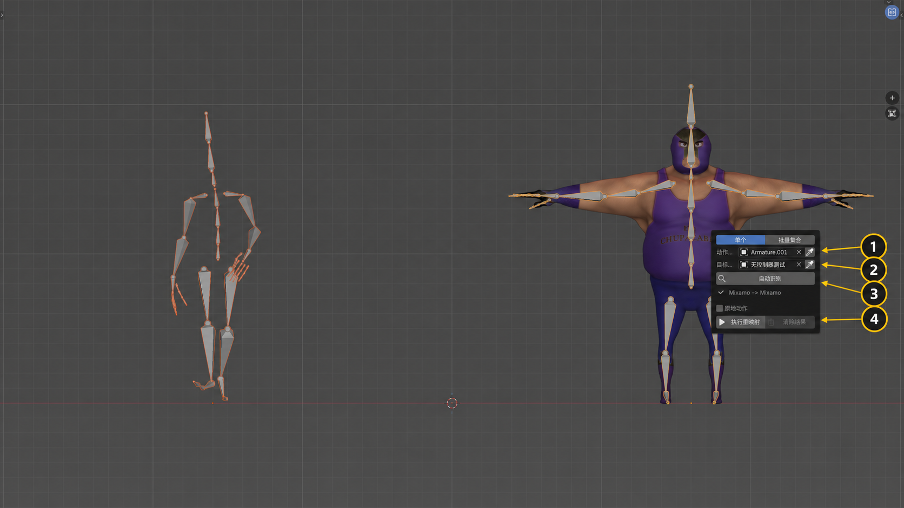

# Rig Bridge

[简体中文](README_zh_CN.md)

Rig Bridge is a Blender add-on that automatically moves animation between humanoid rigs. It recognizes known rig conventions first, then falls back to semantic names, hierarchy, body geometry, rest-pose checks, left/right structure, and forward-axis analysis.

## Features

- Automatic source and target humanoid recognition
- Preset-first matching with name-free structural fallback
- Anonymous-rig recognition for bilateral limbs, torso terminals, toes, and complete finger chains
- Single-action and collection batch retargeting
- Root-motion or in-place output
- Rest-pose and body-forward validation
- Transactional batch cleanup and persistent generated actions
- Optional optimized FK workflow when Auto-Rig Pro is installed

## Requirements

- Blender 5.1 or newer
- Two valid humanoid armatures for the generic workflow
- Auto-Rig Pro is optional and is not bundled

## Installation

### Blender Extensions

The submitted version is available from the [Blender Extensions review page](https://extensions.blender.org/approval-queue/humanoid-remap-studio/). Until catalog review is complete, download the ZIP there and use Install from Disk. Catalog search in Blender becomes available after approval.

### Install from Disk

1. Download the release ZIP from GitHub.
2. Open Blender Preferences > Get Extensions.
3. Open the menu and choose Install from Disk.
4. Select the ZIP and enable the extension.

## Quick Start

1. Open the `Remap` tab in the 3D View sidebar.
2. Choose a single animated armature or a collection of animated armatures.
3. Choose the target humanoid armature.
4. Run Auto Detect.
5. Choose whether the result should stay in place.
6. Run Retarget or Batch Retarget.

Generated actions can be removed with Clear Results before running another test.

## Privacy and Permissions

The extension does not request network, file, clipboard, camera, or microphone permissions.

## Package Structure

The runtime is split into focused modules for action handling, rig recognition, the humanoid canvas, retargeting, operators, UI, and translations. The package entry point only owns registration and scene properties. All internal imports are package-relative, and development reloads use Blender's standard extension lifecycle rather than a custom module reloader.

## Compatibility

The generic retargeting path works without third-party add-ons. If Auto-Rig Pro is installed and a compatible target is detected, Rig Bridge can use its runtime operators for an optimized FK bake. No Auto-Rig Pro files or source code are included.

## Known Limits

- Severely incomplete humanoid rigs are rejected instead of being guessed.
- Unusual rest poses or ambiguous forward axes may require cleanup before retargeting.
- Compatibility coverage continues to expand across rig families and motion sources.

## Creator

- **Bilibili:** [帧给你你来K](https://space.bilibili.com/28424547/)
- **About:** 老王和小C从真实三维问题出发，用 AI 把排查、验证和修复沉淀成可复用流程。

Bilibili is the only social profile published by this project.

## License

Rig Bridge is licensed under the GNU General Public License v3.0 or later. See [LICENSE](LICENSE).
